<p align="center">
  
</p>

# Mini Store E-Commerce App

A sleek, modern, and highly interactive E-Commerce application built with **Flutter**. This application features a premium UI design (including dark mode), complex animations, and full offline persistence for a seamless shopping experience.

## Features

- **Premium UI / UX**: Beautiful product discovery pages, dynamic grid layouts, micro-animations, and custom modal bottom sheets.
- **Native Splash Screen**: Integrated smooth native splash screen using the latest Android 12+ Splash Screen API (Jetpack / Material 3) and iOS Launch Storyboards.
- **State Management**: Robust state management using **Riverpod**.
- **Local Storage**: Full local offline persistence for cart, favorites, user sessions, and settings using **Hive**.
- **Routing**: Smooth nested navigation and page transitions using **GoRouter**.
- **Simulated Checkout**: A complete end-to-end simulated checkout flow including form validations, promo code application (10% off), and animated success screens.
- **Wishlist & Cart**: Add products to your wishlist or cart with dynamic badge updates in the bottom navigation bar.

## Screenshots

### Dark Mode
<p align="center">
  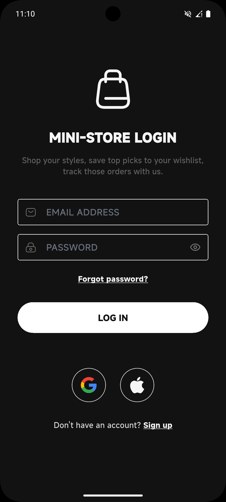
  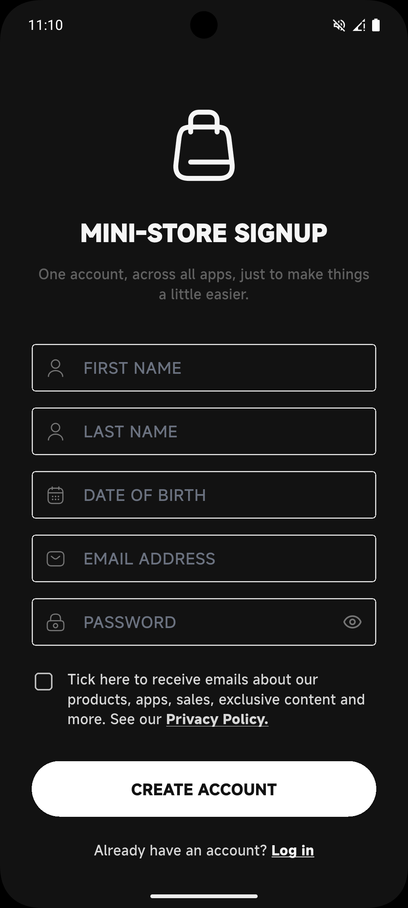
  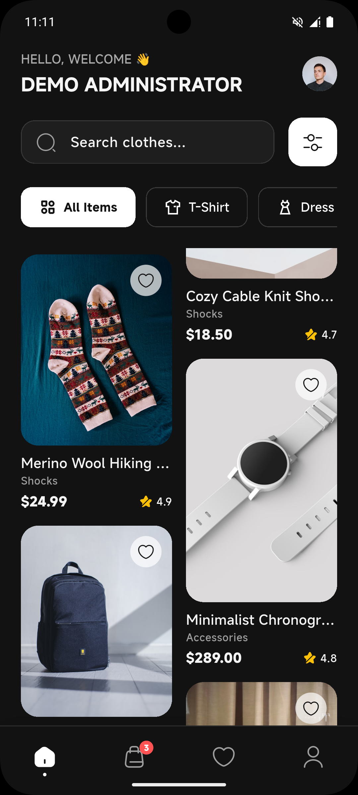
  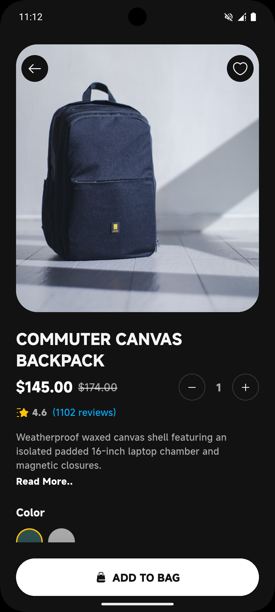
  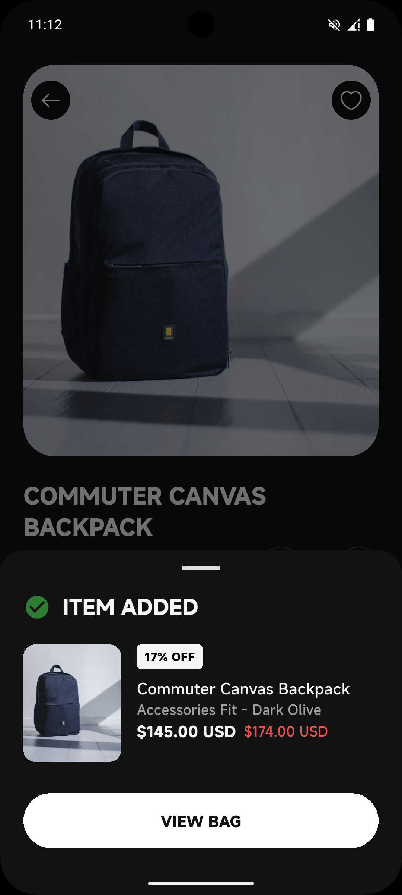
  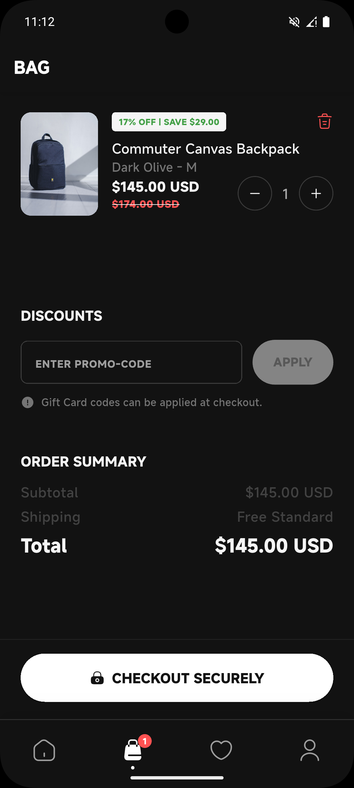
  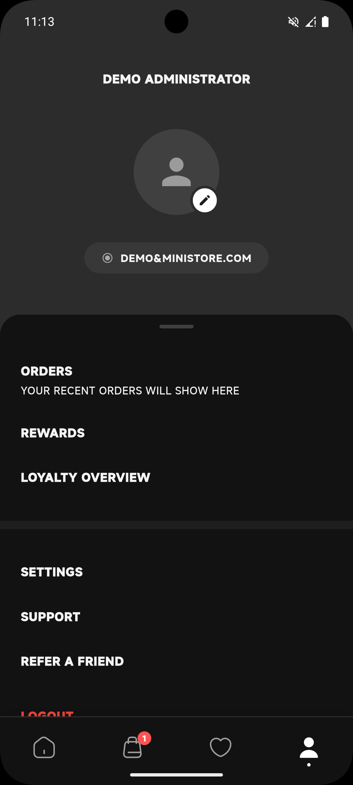
</p>

### Light Mode
<p align="center">
  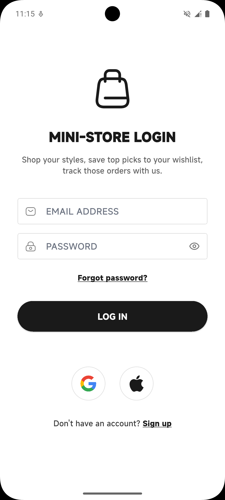
  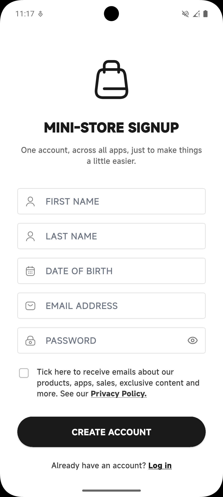
  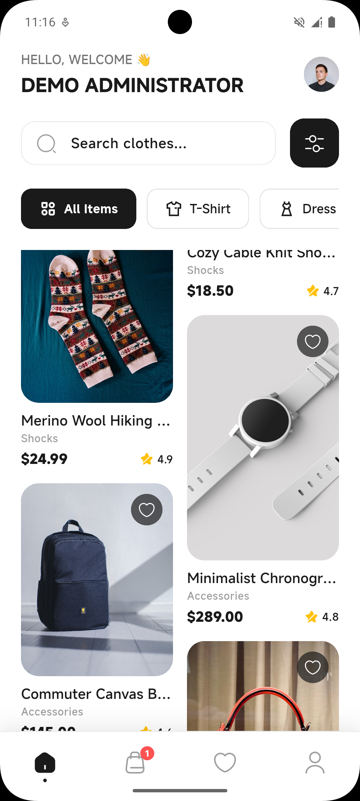
  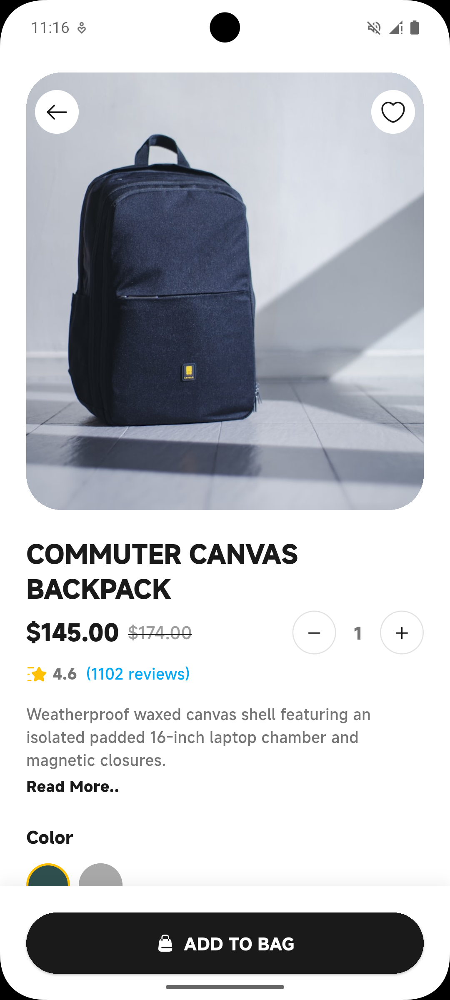
  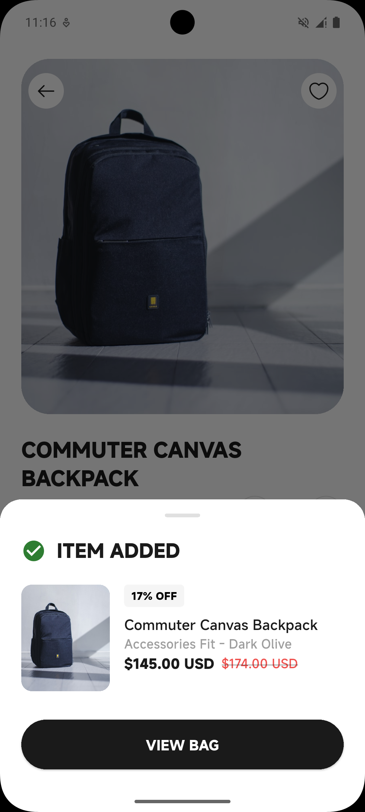
  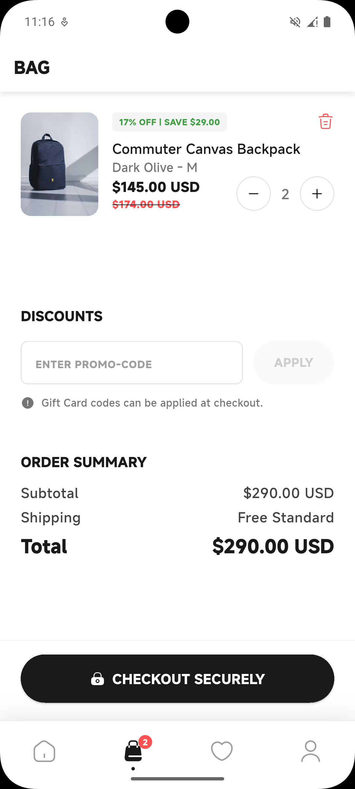
  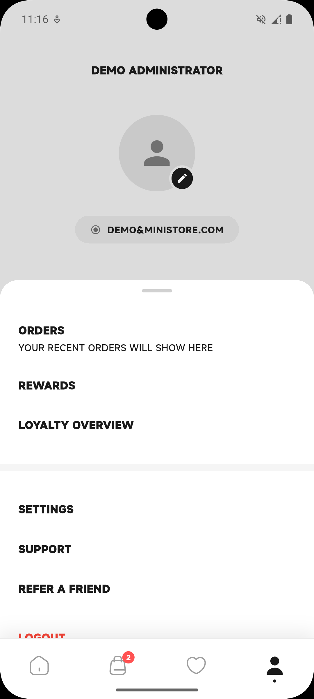
</p>

## Default Credentials

A default administrator account is automatically generated when the app is launched for the first time. You can use these credentials to log in and explore the app:

- **Email:** `demo@ministore.com`
- **Password:** `Demo@admin#1`

*(Note: You can also create a new account from the Sign Up screen, and it will be persisted locally).*

## Getting Started

Follow these instructions to set up and run the project on your local machine.

### Prerequisites

- [Flutter SDK](https://docs.flutter.dev/get-started/install) (latest stable version recommended)
- Dart SDK (comes with Flutter)
- A connected device (iOS/Android emulator or physical device)

### Installation

1. **Clone the repository**
   ```bash
   git clone https://github.com/AppStaticsX/e-commerce-app.git
   cd ecommerce_app
   ```

2. **Install dependencies**
   Fetch the required packages using the Flutter CLI:
   ```bash
   flutter pub get
   ```

3. **Run the App**
   Launch the app on your connected emulator or physical device:
   ```bash
   flutter run
   ```

## Architecture & Packages

- **`flutter_riverpod`**: For reactive and predictable state management.
- **`hive_flutter`**: A lightweight and blazing fast key-value database written in pure Dart.
- **`go_router`**: For declarative routing and nested navigation.
- **`iconsax_flutter`**: Premium icons used throughout the UI.
- **`flutter_staggered_grid_view`**: For the dynamic masonry product grid layout.
- **`loader_overlay`**: For beautiful loading states during async actions (like checkout).

---
*Developed with ❤️ using Flutter.*
